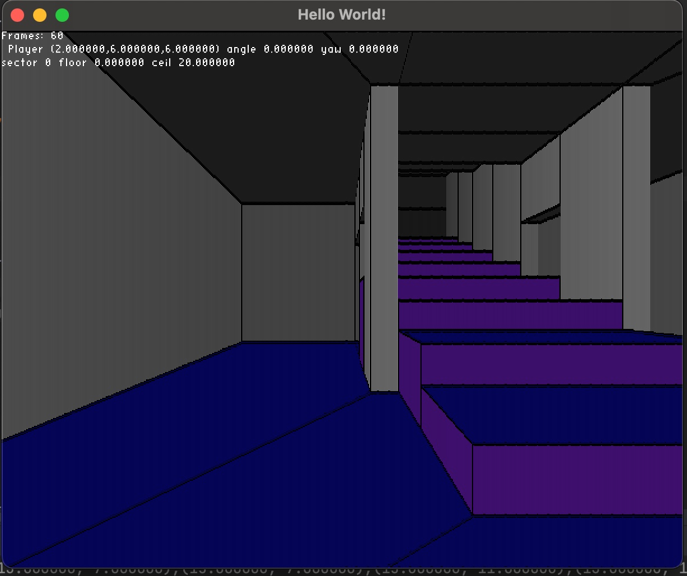

## Simple doom engine in Java
According to Bisqwit's rendering example from https://bisqwit.iki.fi/jutut/kuvat/programming_examples/portalrendering.html.

It uses [LWJGL](https://www.lwjgl.org/) library for OpenGL and slick-util for font rendering. 



This is still work in progress, I have to continue when I find more time.

To compile:
```
javac -classpath 'lib/slick-util/slick-util.jar:lib/lwjgl-release-3.3.1-custom/*' Main.java JavaDoom.java FrameRate.java
```

To start:
```
java -XstartOnFirstThread -classpath '.:lib/slick-util/slick-util.jar:lib/lwjgl-release-3.3.1-custom/*' Main
```
